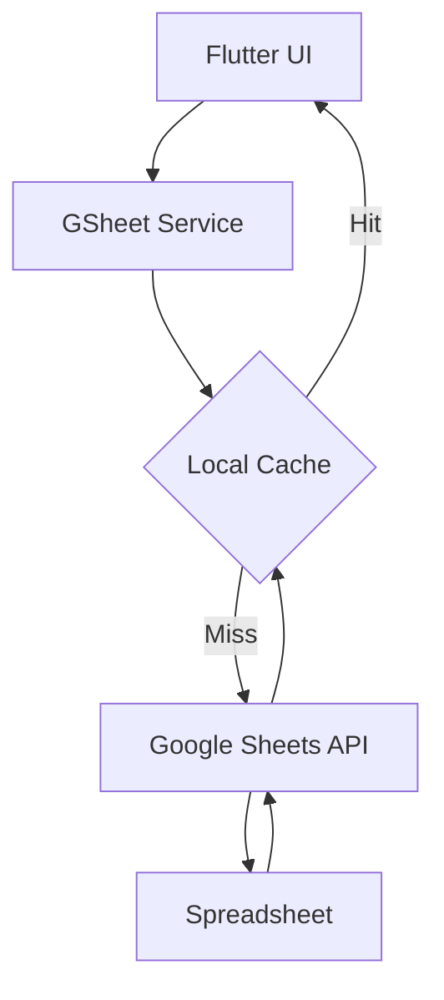

# 3SHW Store Management Application


A high-performance, premium Flutter application designed for real-time inventory management. This application leverages Google Sheets as a serverless backend to provide a lightweight yet powerful solution for hardware store operations, featuring QR code scanning, PDF label printing, and cost-price encoding.

## ✨ Key Features

- **🚀 Real-time Sync**: Instant synchronization with Google Sheets for inventory tracking.
- **🔍 Intelligent Search**: Quickly find products by name, ID, or by scanning QR codes.
- **🏷️ Smart Labels**: Generate and print professional PDF labels with embedded QR codes.
- **🔐 Encoded Pricing**: Built-in utility to encode cost prices on labels for internal store security.
- **📊 Interactive Dashboard**: Visual overview of total inventory capacity and stock levels.
- **🌙 Premium UI**: Sleek dark-mode aesthetic with golden-yellow accents for a professional feel.

## 🛠️ Tech Stack

- **Framework**: [Flutter](https://flutter.dev) (Dart)
- **Database/Backend**: [Google Sheets API](https://developers.google.com/sheets/api)
- **QR Engine**: `mobile_scanner` & `qr_flutter`
- **PDF & Printing**: `pdf` & `printing`
- **State Management**: Stateful Widgets with Optimistic Caching

## 🏗️ Architecture



## 🚀 Getting Started

### Prerequisites

- Flutter SDK Installed
- Google Cloud Project with Sheets API enabled
- Service Account Credentials (JSON)

### Setup Instructions

1. **Clone the repository**:

   ```bash
   git clone https://github.com/Rifnas-Technology/store-application.git
   ```

2. **Configure Google Sheets**:
   - Open `lib/services/gsheet_service.dart`.
   - Replace `_spreadsheetId` with your actual Google Spreadsheet ID.
   - Ensure your Service Account has "Editor" access to the spreadsheet.

3. **Install Dependencies**:

   ```bash
   flutter pub get
   ```

4. **Run the App**:

   ```bash
   flutter run
   ```

## 📁 Project Structure

- `lib/services/`: Core logic for Google Sheets integration and caching.
- `lib/utils/`: Helper functions for price encoding and data formatting.
- `lib/pages/`: Modular UI components for Dashboard, Search, and Labels.
- `assets/`: Image and icon resources.

---

*Developed for high-efficiency store management.*
